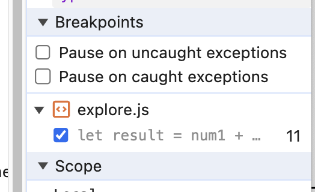
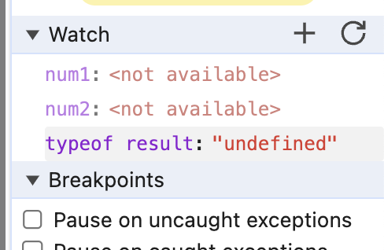
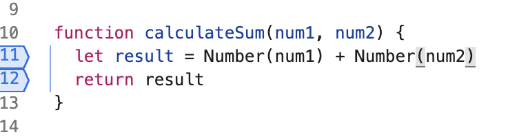

## Screenshots

## Question 1

The bug was that we are not first converting the inputs to numbers before we are adding them, so instead they are being concatenated as strings.

## Question 2

I would fix it by first converting the input values to numbers, using `Number(s)`. Here is a screenshot of the one-line fix:

