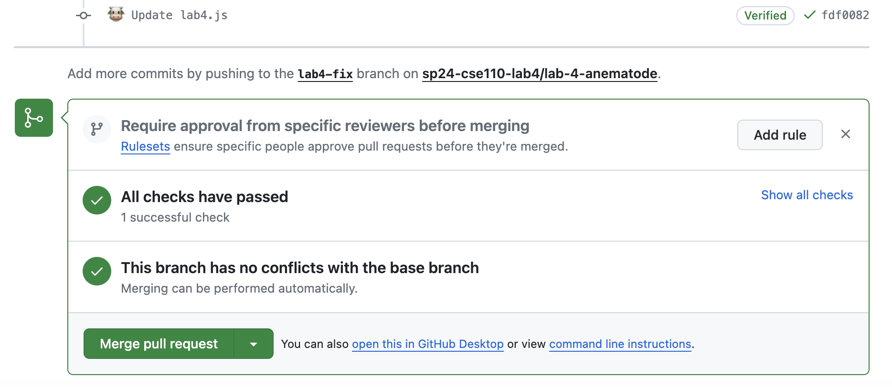

# Part 2

## Question 1

At line 12, `i` will take on the value `prices.length`, which is `3`. That's because `i` was hoisted to the function's scope, and it was last incremented to `prices.length`, at which point control flow exited the loop.

## Question 2

Once again, `discountedPrice` is hoisted to function scope and so we get the most recently assigned value, which is `300 * 0.5 = 150`.

## Question 3

The most recently assigned value to `finalPrice` is `Math.round(discountedPrice * 100) / 100`, which is `150`.

## Question 4

This function will return the list of discounted prices, `[50, 100, 150]`. The code works by going through each price, multiplying it by the complement of the discount to get the final price, and appending the final price to a list, which is ultiamtely returned.

## Question 5

The function will raise a *ReferenceError* at line 12 because `i` is not defined in that scope, as it was defined with `let`. `i` is only valid within the for loop (including its update and loop condition expressions).

## Question 6

The function will raise a *ReferenceError* at line 12 because `discountedPrice` is not defined in that scope, as it was defined with `let`. `discountedPrice` is only valid within the for loop after the let statement.

## Question 7

`finalPrice` persists across loop iterations, so we will get the same answer as Question 3: `150`.

## Question 8

The code returns `[50, 100, 150]` as there is no functional difference compared to Question 4.

## Question 9

The line will raise a *ReferenceError* at line 11 because `i` is not defined in this scope, as it was defined with a `let`.

## Question 10

The length of the input array, `3`, will be printed as the variable is within scope

## Question 11

The rounding step does not actually do anything for our inputs because all the discounted amounts are integers. (Otherwise, it would round to the nearest cent – although I'd point out that this only works because you are lucky about how JS prints things, plus IEEE754 rounding guarantees). Anyway, the result is `[50, 100, 150]`.

## Question 12

Reproduced from `part1-question12.js`:

```js
let student = {
    name: 'Sarah',
    major: 'Computer Science',
    'Grad Year': '2022',
    greeting: function () { console.log('Hello!'); },
    'Favorite Teacher': {
        name: 'Thomas Powell',
        course: 'CSE 110'
    },
    courseLoad: ['CSE 110', 'CSE 134', 'VIS 41']
}

const A = student.name;
const B = student['Grad Year'];
const C = student.greeting();
const D = student['Favorite Teacher'].name;
const E = student.courseLoad[0];
```

## Question 13

```
A. '32'
B. 1
C. 3
D. '3null'
E. 4
F. 0
G. '3undefined'
H. NaN
```

## Question 14

```
A. true
B. false
C. true
D. false
E. false
F. true
```

## Question 15

`===` is a straightforward comparison which is true if the operands are the same number (ignoring `±0` and `NaN`), same string, same boolean, same `undefined`, same `null`, or same object. `==` performs a bunch of implicit conversions that no one can keep track of, and is not even transitive (although it is reflexive).

## Question 16

Reproduced from `part2-question16.js`:

```js
let statistics = {
    redCars: 21,
    blueCars: 45,
    greenCars: 12,
    raceCars: 5,
    blackCars: 40,
    rareCars: 2
};

for (let key in statistics) {
    if (key.startsWith('r') || statistics[key] % 2 !== 0) {
        console.log(statistics[key]);
    }
}
```

## Question 17

The result will be `[2,4,6]`. We're just applying the `doSomething` function to every element in the array, and pushing the results to a result array. Thus the result is the input array with each element scaled by 2.

## Question 18

Reproduced from `part2-question18.js`:

```js
setInterval(() => {
    let d = new Date();
    let time = d.toLocaleTimeString();
    console.log(time);
}, 1000)
```

## Question 19

The output of the code is 
```
1
4
3
2
```

because the 1 and 4 are printed synchronously, the 3 is printed on the next callback queue tick, and the 2 is printed after one second.

## Merging "Done" Code


